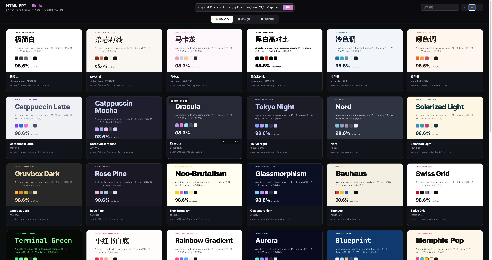
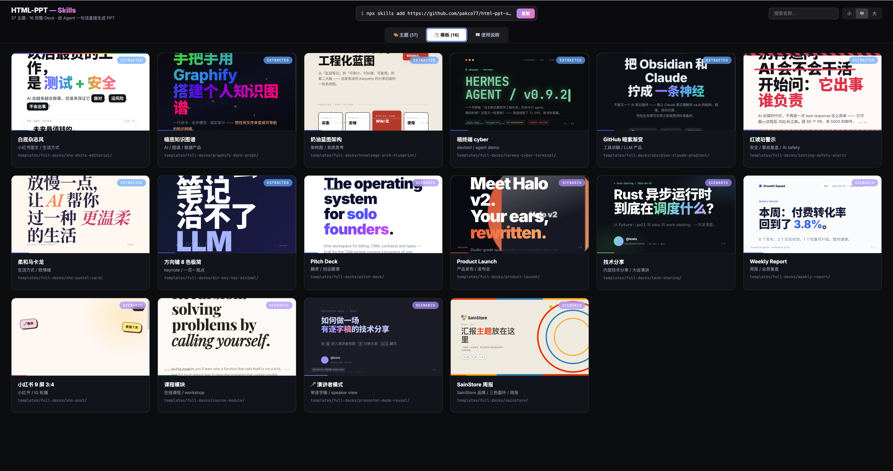
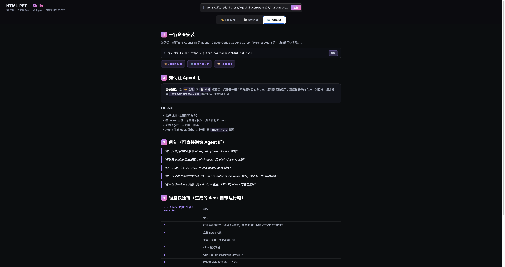

# DeckTaste.skill — *Visual taste menu for AI-generated decks*

**English** · [中文说明 →](README.zh-CN.md)

[](https://github.com/lewislulu/html-ppt-skill)
[](https://github.com/op7418/guizang-ppt-skill)
[](https://github.com/op7418/guizang-social-card-skill)
[](https://github.com/Leonxlnx/taste-skill)
[](LICENSE)

https://github.com/user-attachments/assets/6d212448-62f3-4dfd-9a3d-efb0010d566f


## 🙏 Credit & upstream

DeckTaste is a fork/packaging layer. The real visual work belongs to the upstream authors:

- 🎨 **[lewislulu/html-ppt-skill](https://github.com/lewislulu/html-ppt-skill)** — the core skill: 36 themes, 31 layouts, 47 animations, runtime, presenter mode. **Bundled** in this repo.
- 🪶 **[op7418/guizang-ppt-skill](https://github.com/op7418/guizang-ppt-skill)** (歸藏) — magazine × e-ink and Swiss deck templates. **Bundled** as `guizang-magazine` + `guizang-swiss` (9 color variants).
- 🖼 **[op7418/guizang-social-card-skill](https://github.com/op7418/guizang-social-card-skill)** (歸藏) — the social-image system behind the `🖼 Social Cards` tab. **Declared as a dependency** (`skills-lock.json`), installed on demand — not vendored here.
- 🧩 **[Leonxlnx/taste-skill](https://github.com/Leonxlnx/taste-skill)** — the UI taste system behind the `🧩 UI Taste` tab. **Referenced via copied prompts** — not vendored here.

> What this fork adds: a single-file **visual picker** (`templates/style-picker.html`) that turns all of the above into a click-to-copy taste menu, plus 9 guizang deck variants wired in, a 2-tone Social Cards preview studio, real per-style UI Taste demos, and stability fixes for presenter mode.

## 🎯 One-line positioning

**Stop prompting taste. Pick it.**

DeckTaste is a local-first *visual taste menu* for AI agents. It does not try to be an online PPT editor — it solves a different problem: **how do I tell an agent my taste in a stable, repeatable way?** Browse real previews, click a card, get an executable prompt for Claude Code / Codex / Hermes. The agent generates the deck (or skin, template, social-card set, UI) following the visual constraints you picked.

## ▶ 30-second start

1. **Install** the skill (one line — see [Install](#-install)).
2. **Open the picker.** It ships at `templates/style-picker.html` inside the installed skill. Either open it yourself in a browser, or just tell your agent *"open the DeckTaste picker"*. For live iframe previews, serve the folder (see Install).
3. **Click any card** in 🎨 Skins / 📑 Templates / 🧩 UI Taste / 🖼 Social Cards — the matching prompt is copied to your clipboard.
4. **Paste into your agent**, replace `[paste your outline here]` with your content, hit enter. You get a complete deck you can open in any browser.

## 📦 What's in the box

| Module | Count | Where |
|---|---|---|
| 🎨 **Skins** (CSS re-skin) | **36** | `assets/themes/*.css` |
| 📑 **Templates** (full decks) | **24** | `templates/full-decks/` + guizang variants |
| 🧩 **UI Taste** (picker tab) | 4 | prompts → `Leonxlnx/taste-skill` |
| 🖼 **Social Cards** (picker tab) | 2 tones | prompts → `guizang-social-card-skill` |
| 🧩 **Single-page layouts** | **31** | `templates/single-page/*.html` |
| ✨ **CSS animations** | **27** | `assets/animations/animations.css` |
| 💥 **Canvas FX** | **20** | `assets/animations/fx/*.js` |
| 🎤 **Presenter mode** | — | `S` key / `?preview=N` |

**Skins vs Templates** — a *skin* only swaps color/type over a shared layout (re-skin); a *template* is a full deck with its own HTML structure (re-bone).

| 🎨 Skins (36) | 📑 Templates (24) | 🧩 Layouts (31) |
|---|---|---|
|  |  |  |

<details>
<summary>36 skins · 24 templates · 31 layouts (full lists)</summary>

**36 skins** — `minimal-white`, `editorial-serif`, `soft-pastel`, `sharp-mono`, `arctic-cool`, `sunset-warm`, `catppuccin-latte`, `catppuccin-mocha`, `dracula`, `tokyo-night`, `nord`, `solarized-light`, `gruvbox-dark`, `rose-pine`, `neo-brutalism`, `glassmorphism`, `bauhaus`, `swiss-grid`, `terminal-green`, `xiaohongshu-white`, `rainbow-gradient`, `aurora`, `blueprint`, `memphis-pop`, `cyberpunk-neon`, `y2k-chrome`, `retro-tv`, `japanese-minimal`, `vaporwave`, `midcentury`, `corporate-clean`, `academic-paper`, `news-broadcast`, `pitch-deck-vc`, `magazine-bold`, `engineering-whiteprint`.

**24 templates** — 15 native full decks + 9 guizang color variants. Extracted looks: `xhs-white-editorial`, `graphify-dark-graph`, `knowledge-arch-blueprint`, `hermes-cyber-terminal`, `obsidian-claude-gradient`, `testing-safety-alert`, `xhs-pastel-card`, `dir-key-nav-minimal`. Scenario decks: `pitch-deck`, `product-launch`, `tech-sharing`, `weekly-report`, `xhs-post` (9-slide 3:4), `course-module`, **`presenter-mode-reveal`** 🎤 (full speaker scripts on every slide). Guizang: `guizang-magazine` ×5 + `guizang-swiss` ×4.

**31 layouts** — cover · toc · section-divider · bullets · two-column · three-column · big-quote · stat-highlight · kpi-grid · table · code · diff · terminal · flow-diagram · timeline · roadmap · mindmap · comparison · pros-cons · todo-checklist · gantt · image-hero · image-grid · chart-bar · chart-line · chart-pie · chart-radar · arch-diagram · process-steps · cta · thanks.

</details>

## ✅ When it fits / 🚫 when it doesn't

**Good fit**
- You want an AI agent to build decks / 小红书 social cards / UI **in a specific look you can see first**.
- You keep reusing a visual style and are tired of re-describing it every time.
- You work in Claude Code / Codex / Cursor / Hermes (anything AgentSkill-aware).
- You want pure static HTML output — no build, openable in any browser.

**Not a fit**
- You want a WYSIWYG online PPT editor with drag-and-drop. DeckTaste is a *menu + prompt launcher*, not an editor.
- You don't use an AI agent and want to hand-build slides.
- You expect the `🖼 Social Cards` tab to render images itself — it only copies a prompt (preview + size + prompt import; the upstream skill does the rendering).
- You need realtime collaboration or a hosted cloud service.

## 🤖 Agent support

Works with any runtime that supports AgentSkills. After install the skill lives at:

```
~/.claude/skills/DeckTaste/      # Claude Code
~/.codex/skills/DeckTaste/       # Codex
~/.hermes/skills/DeckTaste/      # Hermes Agent
~/.cursor/…  /  others          # any AgentSkill-aware agent
```

The picker is the same file in every case: `…/DeckTaste/templates/style-picker.html`. Copying a prompt into an agent needs **no MCP**. MCP/a local bridge is only needed if you want the web page to directly launch an agent, read local files, or write the generated folder.

## ⬇️ Install

```bash
npx skills add https://github.com/pakco77/DeckTaste
```

Then open the picker (the second option enables live iframe previews):

```bash
# 1) Just browse cards (previews need a server)
open ~/.claude/skills/DeckTaste/templates/style-picker.html

# 2) Recommended — serve the folder so previews load
cd ~/.claude/skills/DeckTaste && python3 -m http.server 8000
# visit: http://localhost:8000/templates/style-picker.html
```

Click a card → the install command + a ready prompt are on your clipboard → paste into your agent.


## 🗂 Project structure

```
DeckTaste/
├── SKILL.md                      agent-facing dispatcher (skill name: DeckTaste)
├── README.md / README.zh-CN.md   docs (EN / 中文)
├── skills-lock.json              declared skill deps (guizang-social-card-skill)
├── references/                   detailed catalogs (themes, layouts, animations, full-decks, presenter-mode)
├── assets/
│   ├── base.css                  shared design tokens + primitives
│   ├── runtime.js                keyboard nav + presenter + overview
│   ├── themes/*.css              36 skin token files
│   └── animations/               27 CSS animations + 20 canvas FX
├── templates/
│   ├── style-picker.html         ★ the DeckTaste WebUI (Skins/Templates/UI Taste/Social Cards/Guide)
│   ├── deck.html                 minimal starter
│   ├── *-showcase.html           theme / layout / animation tours
│   ├── full-decks/<name>/        17 deck folders (15 native + guizang-magazine/-swiss)
│   └── single-page/*.html        31 layout files with demo data
├── scripts/                      new-deck.sh · render.sh · verify-output/
└── examples/                     local builds + decktaste.local.json (git-ignored)
```

## 🎨 Create your own skin / deck

The picker has two custom cards — **`+ Custom skin`** (🎨 Skins tab) and **`+ Custom template`** (📑 Templates tab). Click one, paste the copied prompt into your agent.

- Each build outputs to a unique `examples/<slug>/` (pick a meaningful slug).
- You can stack **many** custom skins/templates — each appends to `examples/decktaste.local.json`, never overwrites, and shows as a `local` card after you refresh the picker.
- Manual path: `./scripts/new-deck.sh <slug>` then `open examples/<slug>/index.html`.

`decktaste.local.json` is git-ignored — it's your personal taste library, not a public catalog, and it does not change the public counts.

## 🧭 Philosophy

- **Token-driven design system.** Color, radius, shadow, type all live in `assets/base.css` + the active skin. Change one variable, the whole deck reflows tastefully.
- **See it before you pick it.** Every preview is a real, isolated `<iframe>` render — no screenshots, no mock-ups.
- **Menu, not generator.** DeckTaste copies executable prompts; your agent does the generating. That keeps it model-agnostic and zero-build.
- **Senior-designer defaults.** Opinionated type scale, spacing rhythm, gradients — no "Corporate PowerPoint 2006".
- **Chinese + English first-class.** Noto Sans SC / Noto Serif SC pre-imported.

## License

MIT © 2026 lewis &lt;sudolewis@gmail.com&gt;. Upstream skills retain their own licenses and attribution (see [Credit & upstream](#-credit--upstream)).
