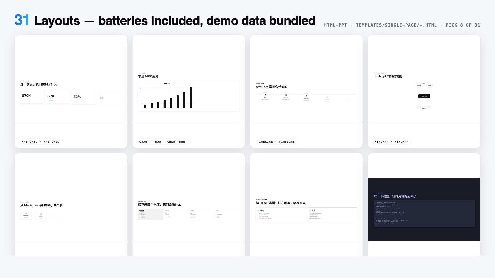

# HTML PPT Picker — *Visual deck selector for HTML presentations*

[](https://github.com/lewislulu/html-ppt-skill)
[](https://github.com/op7418/guizang-ppt-skill)
[](https://github.com/lewislulu/html-ppt-skill/stargazers)
[](https://github.com/op7418/guizang-ppt-skill/stargazers)
[](LICENSE)

> 🙏 **Credit to [@lewislulu](https://github.com/lewislulu)** (core skill) and **[@op7418 歸藏](https://github.com/op7418)** (magazine + swiss decks). This fork adds a visual picker for previewing themes, deck templates, and ready-to-copy prompts.

> A world-class AgentSkill for producing professional HTML presentations in
> **36 themes**, **24 full-deck picker cards** (15 native + 9 guizang variants),
> **31 page layouts**, **47 animations** (27 CSS + 20 canvas FX), and a
> **true presenter mode** with pixel-perfect previews + speaker script + timer
> — all pure static HTML/CSS/JS, no build step.

**Author:** lewis &lt;sudolewis@gmail.com&gt;
**License:** MIT
**中文文档:** [README.zh-CN.md](README.zh-CN.md)

> ## 🙏 About This Fork
>
> This fork keeps the upstream skill intact and adds a visual picker layer:
>
> - 🎨 **Core skill** — [**lewislulu/html-ppt-skill**](https://github.com/lewislulu/html-ppt-skill): 36 themes, 31 layouts, 47 animations, presenter mode.
> - 🪶 **Magazine & Swiss decks** — [**op7418/guizang-ppt-skill**](https://github.com/op7418/guizang-ppt-skill) (歸藏): 2 deck templates × 9 color variants, WebGL fluid/grid backgrounds.
>
> What this fork adds on top:
>
> - 🎨 **Interactive WebUI picker** — `templates/style-picker.html`: browse themes × layouts × full-decks visually, then copy install/usage prompts in one click.
> - 🪶 **+9 guizang deck variants** — `guizang-magazine` (5 colors) + `guizang-swiss` (4 colors), wired into the picker with author attribution.
> - 🐛 **Stability fixes** for `presenter-mode-reveal`.
>
> Positioning: a small, practical visual picker on top of a static HTML presentation skill — not a new framework, no runtime, still pure static HTML/CSS/JS, no build step.

## 🎨 HTML PPT Picker (this fork's main addition)

A single static HTML file at `templates/style-picker.html` lets you browse all themes / templates / layouts visually, then copy a ready-made prompt to paste into your AI agent.

| Themes (36) | Full-Deck Picker Cards (24) | Page Layouts (31) |
|---|---|---|
|  |  |  |

### How to launch it

After you (or your AI agent) install this skill, the file lives at:

```
~/.claude/skills/html-ppt/templates/style-picker.html      # Claude Code
~/.codex/skills/html-ppt/templates/style-picker.html       # Codex
~/.hermes/skills/html-ppt/templates/style-picker.html      # Hermes Agent
```

Pick one of these to open it:

```bash
# 1) Just open the file (works for browsing only — previews in iframes need a server)
open ~/.claude/skills/html-ppt/templates/style-picker.html

# 2) Recommended — serve the skill folder so iframe previews load (any port, any agent)
cd ~/.claude/skills/html-ppt && python3 -m http.server 8000
# then visit:  http://localhost:8000/templates/style-picker.html

# Or with Node:
cd ~/.claude/skills/html-ppt && npx --yes serve -l 8000
```

Click any card → the install command + a ready prompt is copied to your clipboard. Paste it into your AI agent and you're done.


> One command installs **36 themes × 20 canvas FX × 31 layouts × 24 deck picker cards + presenter mode**. Every preview above is a live iframe of a real template file rendering inside the deck — no screenshots, no mock-ups.

## 🎤 Presenter Mode (new!)

Press `S` on any deck to pop open a dedicated presenter window with four
draggable, resizable **magnetic cards**: current slide, next slide preview,
speaker script (逐字稿), and timer. Two windows stay in sync via
`BroadcastChannel`.


**Why previews are pixel-perfect:** each card is an `<iframe>` that loads the
same deck HTML with a `?preview=N` query param. The runtime detects this and
renders only slide N with no chrome — so the preview uses the **same CSS,
theme, fonts and viewport** as the audience view. Colors and layout are
guaranteed identical.

**Smooth (no-reload) navigation:** on slide change, the presenter window
sends `postMessage({type:'preview-goto', idx:N})` to each iframe. The iframe
just toggles `.is-active` between slides — **no reload, no flicker**.

**Speaker script rules (3 golden):**
1. **Prompt signals, not lines to read** — bold the keywords, separate
   transition sentences into their own paragraphs
2. **150–300 words per slide** — that's the ~2–3 min/page pace
3. **Write it like you speak** — conversational, not written prose

See [`references/presenter-mode.md`](references/presenter-mode.md) for the
full authoring guide, or copy the ready-made template at
`templates/full-decks/presenter-mode-reveal/` which ships with full 150-300
word speaker scripts on every slide.

## Install (one command)

```bash
npx skills add https://github.com/pakco77/html-ppt-picker
```

That registers the skill with your agent runtime. After install, any agent
that supports AgentSkills can author presentations by asking things like:

> "做一份 8 页的技术分享 slides，用 cyberpunk 主题"
> "turn this outline into a pitch deck"
> "做一个小红书图文，9 张，白底柔和风"

## What's in the box

| | Count | Where |
|---|---|---|
| 🎤 **Presenter mode** | **NEW** | `S` key / `?preview=N` |
| 🎨 **Themes** | **36** | `assets/themes/*.css` |
| 📑 **Deck picker cards** | **24** | `templates/full-decks/<name>/` + Guizang variants |
| 🧩 **Single-page layouts** | **31** | `templates/single-page/*.html` |
| ✨ **CSS animations** | **27** | `assets/animations/animations.css` |
| 💥 **Canvas FX animations** | **20** | `assets/animations/fx/*.js` |
| 🖼️ **Showcase decks** | 4 | `templates/*-showcase.html` |
| 📸 **Verification screenshots** | 56 | `scripts/verify-output/` |

### 36 Themes

`minimal-white`, `editorial-serif`, `soft-pastel`, `sharp-mono`, `arctic-cool`,
`sunset-warm`, `catppuccin-latte`, `catppuccin-mocha`, `dracula`, `tokyo-night`,
`nord`, `solarized-light`, `gruvbox-dark`, `rose-pine`, `neo-brutalism`,
`glassmorphism`, `bauhaus`, `swiss-grid`, `terminal-green`, `xiaohongshu-white`,
`rainbow-gradient`, `aurora`, `blueprint`, `memphis-pop`, `cyberpunk-neon`,
`y2k-chrome`, `retro-tv`, `japanese-minimal`, `vaporwave`, `midcentury`,
`corporate-clean`, `academic-paper`, `news-broadcast`, `pitch-deck-vc`,
`magazine-bold`, `engineering-whiteprint`.


Each is a pure CSS-tokens file — swap one `<link>` to reskin the entire deck.
Browse them all in `templates/theme-showcase.html` (each slide rendered in an
isolated iframe so theme ≠ theme is visually guaranteed).


### 24 deck picker cards

15 native full-deck templates plus 9 Guizang color variants. The native set contains eight extracted visual languages and seven generic scenario scaffolds:

**Extracted looks**
- `xhs-white-editorial` — 小红书白底杂志风
- `graphify-dark-graph` — 暗底 + 力导向知识图谱
- `knowledge-arch-blueprint` — 蓝图 / 架构图风
- `hermes-cyber-terminal` — 终端 cyberpunk
- `obsidian-claude-gradient` — 紫色渐变卡
- `testing-safety-alert` — 红 / 琥珀警示风
- `xhs-pastel-card` — 柔和马卡龙图文
- `dir-key-nav-minimal` — 方向键极简

**Scenario decks**
- `pitch-deck`, `product-launch`, `tech-sharing`, `weekly-report`,
  `xhs-post` (9-slide 3:4), `course-module`,
  **`presenter-mode-reveal`** 🎤 — complete talk template with full 150-300
  word speaker scripts on every slide, designed around the `S` key presenter mode

Each is a self-contained folder with scoped `.tpl-<name>` CSS so multiple
decks can be previewed side-by-side without collisions. Browse the full
gallery in `templates/full-decks-index.html`.



### 31 Single-page layouts

cover · toc · section-divider · bullets · two-column · three-column ·
big-quote · stat-highlight · kpi-grid · table · code · diff · terminal ·
flow-diagram · timeline · roadmap · mindmap · comparison · pros-cons ·
todo-checklist · gantt · image-hero · image-grid · chart-bar · chart-line ·
chart-pie · chart-radar · arch-diagram · process-steps · cta · thanks

Every layout ships with realistic demo data so you can drop it into a deck
and immediately see it render.


*The big iframe is loading `templates/single-page/<name>.html` directly and cycling through all 31 layouts every 2.8 seconds.*


### 27 CSS animations + 20 Canvas FX

**CSS (lightweight)** — directional fades, `rise-in`, `zoom-pop`, `blur-in`,
`glitch-in`, `typewriter`, `neon-glow`, `shimmer-sweep`, `gradient-flow`,
`stagger-list`, `counter-up`, `path-draw`, `morph-shape`, `parallax-tilt`,
`card-flip-3d`, `cube-rotate-3d`, `page-turn-3d`, `perspective-zoom`,
`marquee-scroll`, `kenburns`, `ripple-reveal`, `spotlight`, …

**Canvas FX (cinematic)** — `particle-burst`, `confetti-cannon`, `firework`,
`starfield`, `matrix-rain`, `knowledge-graph` (force-directed physics),
`neural-net` (signal pulses), `constellation`, `orbit-ring`, `galaxy-swirl`,
`word-cascade`, `letter-explode`, `chain-react`, `magnetic-field`,
`data-stream`, `gradient-blob`, `sparkle-trail`, `shockwave`,
`typewriter-multi`, `counter-explosion`. Each is a real hand-rolled canvas
module auto-initialised on slide enter via `fx-runtime.js`.

## Quick start (manual, after install or git clone)

```bash
# Scaffold a new deck from the base template
./scripts/new-deck.sh my-talk

# Browse everything
open templates/theme-showcase.html         # all 36 themes (iframe-isolated)
open templates/layout-showcase.html        # all 31 layouts
open templates/animation-showcase.html     # all 47 animations
open templates/full-decks-index.html       # all 15 native full decks

# Render any template to PNG via headless Chrome
./scripts/render.sh templates/theme-showcase.html
./scripts/render.sh examples/my-talk/index.html 12
```


## Customize or contribute your own deck

Want to create a private deck first? Scaffold one locally and keep it in `examples/`:

```bash
./scripts/new-deck.sh my-talk
open examples/my-talk/index.html
```

Want to open-source a reusable template? Add it under `templates/full-decks/<slug>/`, register it in the picker/docs, then run the verification checklist. See [`CONTRIBUTING.md`](CONTRIBUTING.md) for the exact sync points.

## Keyboard cheat sheet

```
← → Space PgUp PgDn Home End   navigate
F                               fullscreen
S                               open presenter window (magnetic cards)
N                               quick notes drawer (bottom)
R                               reset timer (in presenter window)
O                               slide overview grid
T                               cycle themes (syncs to presenter)
A                               cycle a demo animation on current slide
#/N (URL)                       deep-link to slide N
?preview=N (URL)                preview-only mode (single slide, no chrome)
```

## Project structure

```
html-ppt-picker/
├── SKILL.md                      agent-facing dispatcher
├── README.md                     this file
├── references/                   detailed catalogs
│   ├── themes.md                 36 themes with when-to-use
│   ├── layouts.md                31 layout types
│   ├── animations.md             27 CSS + 20 FX catalog
│   ├── full-decks.md             24 deck picker cards
│   └── authoring-guide.md        full workflow
├── assets/
│   ├── base.css                  shared tokens + primitives
│   ├── fonts.css                 webfont imports
│   ├── runtime.js                keyboard + presenter + overview
│   ├── themes/*.css              36 theme token files
│   └── animations/
│       ├── animations.css        27 named CSS animations
│       ├── fx-runtime.js         auto-init [data-fx] on slide enter
│       └── fx/*.js               20 canvas FX modules
├── templates/
│   ├── deck.html                 minimal starter
│   ├── theme-showcase.html       iframe-isolated theme tour
│   ├── layout-showcase.html      all 31 layouts
│   ├── animation-showcase.html   47 animation slides
│   ├── full-decks-index.html     15-deck native gallery
│   ├── full-decks/<name>/        17 deck folders (15 native + 2 Guizang bases)
│   └── single-page/*.html        31 layout files with demo data
├── scripts/
│   ├── new-deck.sh               scaffold
│   ├── render.sh                 headless Chrome → PNG
│   └── verify-output/            56 self-test screenshots
└── examples/demo-deck/           complete working deck
```

## Philosophy

- **Token-driven design system.** All color, radius, shadow, font decisions
  live in `assets/base.css` + the current theme file. Change one variable,
  the whole deck reflows tastefully.
- **Iframe isolation for previews.** Theme / layout / full-deck showcases all
  use `<iframe>` per slide so each preview is a real, independent render.
- **Zero build.** Pure static HTML/CSS/JS. CDN only for webfonts, highlight.js
  and chart.js (optional).
- **Senior-designer defaults.** Opinionated type scale, spacing rhythm,
  gradients and card treatments — no "Corporate PowerPoint 2006" vibes.
- **Chinese + English first-class.** Noto Sans SC / Noto Serif SC pre-imported.

## License

MIT © 2026 lewis &lt;sudolewis@gmail.com&gt;.
